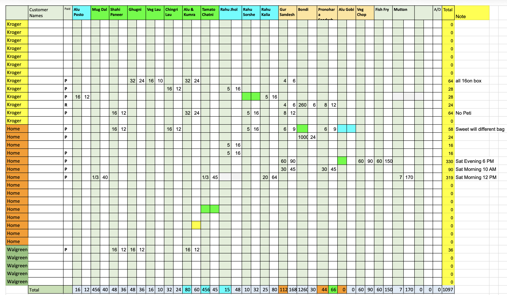

## Introduction
So, one of the primary reasons for starting this blog was to document all of my work I have done for my families business. We own a home based Bengali food business, and it has been quite a journey since we started back in 2020! Keep reading on so I can fully break down everything I have done, and in order to make it more readable, I may very well break down all the work in different blog posts. So here goes!

### Motivation: 
So our food business, Machh Mishti More (or MMM for short) in Bengali means Fish, Sweets and More. So, this business was actually my mom's business. She took care of everything for it, and she actually passed away a few years ago. While it was hard on us, my dad and I knew what it meant for her. So we decided to continue on her business as her legacy.

When we decided to continue MMM, we were very inexperienced. Yes, my dad and I were there with my mom while she handled the cooking, the orders, the Indian sweets, but we never knew how...much everything was. And when we started off, we also weren't very good at it to be quite honest. I was finishing up my undergrad in CS, and my dad was also working full time, and while this business was a weekend only affair, it still took so much time and effort, and a lot of mistakes were made. Quite a lot to be honest, we sometimes messed up orders, forgot to write down orders, and things like that. And thats with the actual cooking required because... it's a home kitchen in the first place. 

So, this along with some of my personal grief at the time, I decided to take a gap year after my undergrad, to work on the family business, learn the insides and outs, and learn not only how to improve the business, but also how to make it less taxing on me and my dad. And I did learn a lot! I slowly started understanding how to start marketing it better, I learned what sells and what doesn't, how we need to 'rotate' what we sell to get orders. Sell seasonal things, and started understanding most of this. And one thing that we really needed was a website, where we can increase visibility. More on that here: 

### How Things Were
In the past, I know my mom used to take down the orders from 3 different WhatsApp groups based on the pickup location, then we would jot them down in an excel file, with quantity, price, of each item with pickup location and total, with all the total prices at the last column, calculated to have the sum total at the bottom. 

_Every weekend's orders, tracked by hand — one row per customer, one column per dish, totals calculated down the side and bottom. This is what we were replacing._

And this worked for us exceptionally well in the past and we rarely if ever had any kind of issues with this and so once my dad and I took over, we had a 'why fix whats not broken?' kind of mentality to it. 
And well, it was kind of broken, because simple errors in either manually writing them down, or forgetting one item for a person or even entire orders. And actually, this led to our business actually losing customers and money in the process, because who would want to order food only for it some of it to show up and other matters. So this led to me to also take a gap year after my undergrad to work out some of these issues, and expand on ways to improve the business. 

### Where are we now
So, after staying back and working on our business, I actually started admiring and appreciating the business side of it all. Not just like the customer interaction or the whole cooking thing (which I must say I am still not that good at), but the data part of it as a whole. I started noticing that we have a lot of repeat customers, who actually order similar things, like a fish curry or some kind of a veg curry, things of that nature. They are what I started to look at as dependable trackers of sorts, where we know what to order in terms of ingredients based off how many of the repeat customers we got, and we can establish a baseline of how many orders we might get in a week. Now there are different trends as well that also factor in: if there is a long weekend or if its a summer or winter break these actually lead us to have fewer orders. On the flip side: An Indian festival, or some of the auspicious months would lead us to have a lot more orders for those time frames. These are just trends that I have noticed, but I also wanted to account for this somehow to make it easier for us to know what to kind of orders we can get. 

I also started my Master's in Business Analytics at UTD partly because of how much I started to appreciate the business side of gathering the data, and also because of my undergrad in CS, I wanted to find a way where I can use everything that I have learnt, and still learning, to put it to use to improve a business that I do care about deeply. 

Enter machhmishti.com

