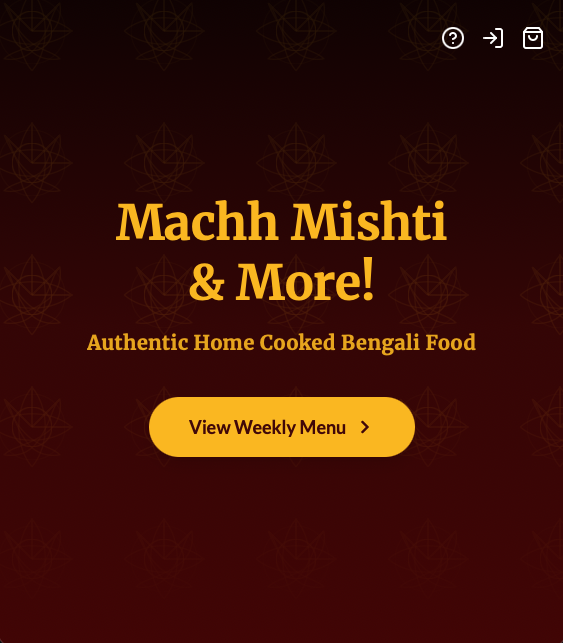
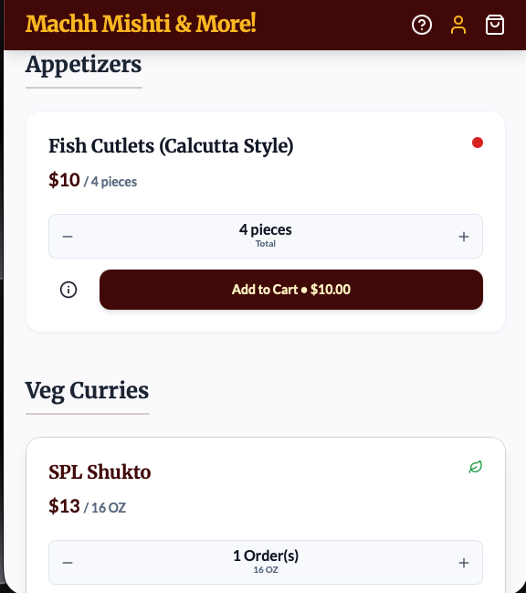
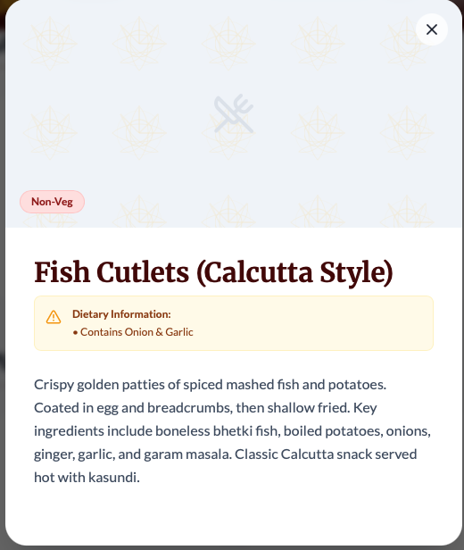
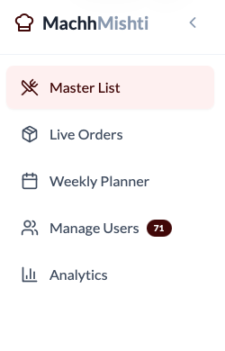
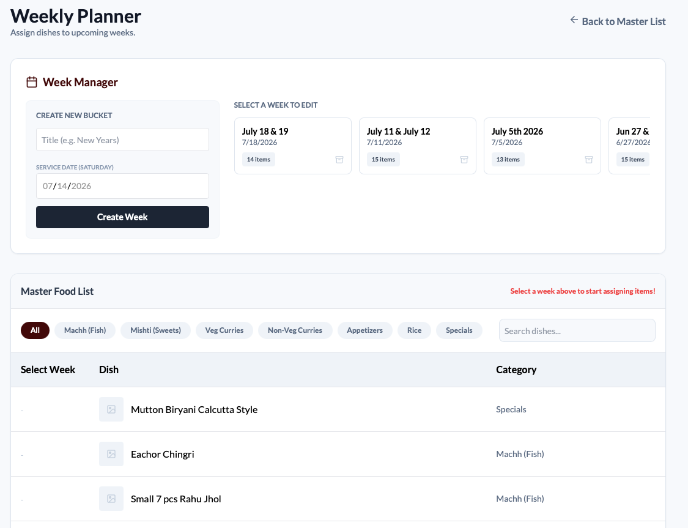

## Introduction
In this blog post, we are going to look through some of the fundamental design decisions I wanted to start off with, and how I tackled some of the initial challenges. 

## Half-Baked Ideas
When I got started working on this project, I honestly did not have a clear idea of what I wanted to get done with it. I wanted to start off the design of the website to kind of just focus on actually showing what we are selling, more like a homepage of sorts, with the menu posted per week, possibly a basic description and a 'contact us' part so people can inquire or place orders and we would write it through WhatsApp. However, while this would have helped with the 'visibility' of our business, it wouldn't actually solve the issue of taking down the orders. And even if I wrote down all the frontend code for designing the menu for one week, it would still require me to change it every week which would have become very very cumbersome. It would've worked great if we sold just the same things every week. So I decided to look into designing a full stack application for these reasons, more on that in a bit. 

## Deciding The Right Ingredients
Now that I decided on wanting to build the full system: from displaying our menu to the ordering process, I had to look at some of my options and my reasoning with some of it. One of the first decisions was the platform: Should I use a website builder or should I go for a custom built application? I did not want to build something that was dependent on subscriptions and most website builders are subscription based, so that was a hard no for me. There was WordPress, but I wanted more control over all of the decisions I made, rather than depending on a free theme then hosting it, and other quibbles. So in the end I decided to build all of it up from scratch using React built with Vite and then styled with Tailwind CSS. Since most users (our customers) would be using the website from their phones, I made sure that the UI was suited best for that use case, and so each of the items would be on a tile, with a simple quantity toggle, price that dynamically changes based on the quantity, and a little info toggle to learn a little more about the dish including any dietary information such as if it contains nuts, or if it has onion and garlic (which is actually a big thing for many Indians) and so on. 

This is great and all and a beautiful UI, if I say so myself, but how am I actually creating all of the menu items with the pricing and quantities you might ask (or not)? Well, I am glad you asked, because I was also just about to talk about it too (crazy how that worked out huh)! SO, for the backend of the project, I didn't want to have to create the authentication, databases and figuring out the hosting from scratch, but neither did I want to depend on yet another subscription platform OR something from any company that might use the user's personal data in some format.

I am also heavily invested in the whole save your personal data and hosting my own cloud storage, Network Attached Storage, etc. I already had a server running a bunch of containers that I use for saving my phone's camera roll, local AI models, and a bunch of other cool things, so I wanted to look into something that is a Backend As A Service (BaaS), but also that can be locally hosted, because I have the means to. Enter Appwrite. 
I had actually read up on Appwrite a few years ago for a different project, so I already kind of had a basic understanding of what I can do with it. 
So Appwrite handles all of my authentication, databases, functions and all of it locally and securely via Cloudflare tunnels, and the only people who can access all of it is me or my dad, with the right authentication, while also meeting one of my personal requirements being that none of the personal data is being shared with any outside parties. And best of all, its locally hosted and scalable, so once I continue to iterate and improve some of the things, I can use Appwrite for that as well (like messaging customers). But all of this will be in a later, more technical post. 

## What's on the Menu
We got pretty far on the user side of things that I worked on, but what's the point of all that if there's not an intuitive admin side to manage all of this right? So, in this section we will do exactly that: a tour of the admin side of the application. Let's go!
One of the things I set out to do when working on this project was trying to make the order viewing process or billing or adding things to the weekly menu much more intuitive so that we fix some of the earlier mistakes we were making. So that means the admin side has to be easy to read because I don't want to miss an item from someone's order. And it has to be secure, nobody but my dad and me should have access to this. 
Anyways, the way I broke it down was that I will have a Master List page, for where we create each item we sell, a Live Orders page, to track the orders for that week with other views (more on that later too), Weekly Planner page which we use to make the menu for a week, a manage users section where we authenticate users and an Analytics page which is what I want to focus on more in the coming few weeks. 

## Save Room for Dessert
So that's the whole project at a glance, a little commentary on some of my decisions, the stack I decided on using, and a very light tour of both sides of the app. I didn't go over a lot of the critical functionalities like how does the ordering process work, what's with the ordering open status thing, what's with some of the AI buttons, and other things, and rest assured they will also be dealt with in future blog posts. If I started writing everything I did in one post, I'm pretty sure I would fall asleep writing it. So stay tuned! 

